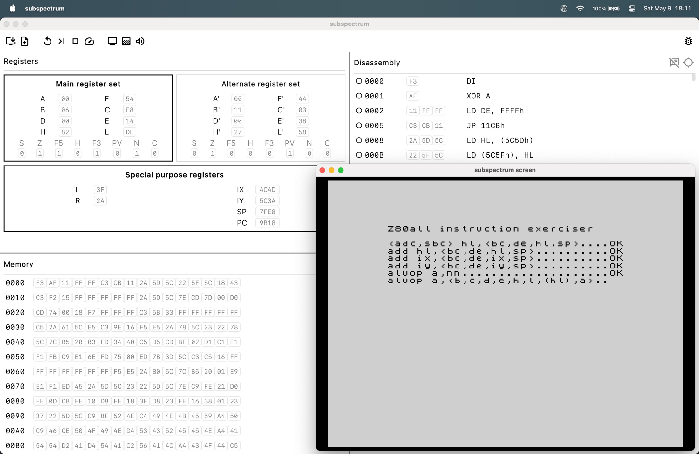

<!-- footer: 'Klemen Remec, 17.7.2026' -->

# Emulacija računalnika ZX Spectrum z vpogledom v stanje sistema

Avtor: Klemen Remec
Mentor: izr. prof. dr. Jurij Mihelič

Fakulteta za računalništvo in informatiko, Univerza v Ljubljani

<!--
Pozdravljeni
-->

---

<!-- footer: '' -->

# Povzetek

- ZX Spectrum 48K: zgodovina, zgradba
- cilji dela
- razvoj in končna implementacija
- pregled in ovrednotenje končnih rezultatov

---

<!-- header: '' --->

# ZX Spectrum 48K

---

<!-- header: '**Zgodovina**' -->

<!--
Sinclair Research razvijalo nizkocenovne domače računalnike: ZX80, ZX81

ZX Spectrum: predstavljen leta 1982 kot zmogljivejši naslednik

Novosti:
- barvna grafika, po kateri je dobil ime
- zvok
- podpora za programsko okolje BASIC

Model 48K predstavlja najbolj razširjeno različico Spectruma
- nadaljnja obravnava in implementacija emulatorja se osredotočata na ta model
-->

---

<!-- header: '**Zgradba**' -->
<!-- _class: columns -->

<!--
Procesor Z80, 16 KB ROMa in 16KB ali 48 KB RAMa
(kasneje Spectrum 128 s 128 KB RAMa preko bank pomnilnika)

Podpora:
- tipkovnica
- UHF zaslon
- zvok
- kasete

CPE Z80:
- ROM, RAM
- ULA: komunikacijski center sistema (CPE <-> pomnilnik, zaslon)
-->

---

<!-- header: '' --->

# Cilji dela

---

<!-- header: 'Emulacija' -->

**Emulacija**: gostovanje sistemov, zasnovanih za drugačne arhitekture kot arhitektura gostitelja

- prevod ukazov gosta v ukaze arhitekture gostitelja
- emulacija delovanja gostove strojne opreme

<!--
Emulacija omogoča gostovanje sistemov, zasnovanih za drugačne arhitekture kot arhitektura gostitelja
- prevod ukazov gosta v ukaze arhitekture gostitelja
- v tem primeru tudi emulacija delovanja gostove strojne opreme
-->

---

<!-- header: '**Cilji dela**' -->

<!--
Cilj: Razvoj delujočega emulatorja in razhroščevalnika

Poganjanje programov

Razhroščevanje z vpogledom v notranje stanje sistema
- boljše razumevanje sistema
- ohranjanje znanja o njegovem delovanju
-->

---

<!-- header: '' --->

# Razvoj

---

<!-- header: 'Uporabljene tehnologije' -->

- Kotlin Multiplatform
- Compose Multiplatform
- Gradle

<!--
Kotlin Multiplatform: ogrodje za razvoj aplikacij s skupno programsko kodo za različne platforme
Compose Multiplatform: knjižnica za razvoj uporabniških vmesnikov
Gradle: orodje za izvajanje testov in gradnjo končnih aplikacij
-->

---

<!-- header: 'Arhitektura in uporabniški vmesnik' -->

Moduli funkcionalnosti:

- `Processor`
- `Memory`
- `ULAScreen`, `ULAKeyboard`, `ULATapeDeck`, `ULABeeper`

<!--
Abstraktni model emuliranega sistema SpectrumMachine povezuje module funkcionalnosti.

Uporabniški vmesnik:
- naloži ROM in kasetni program
- ponastavi stanje sistema
- zažene, ustavi procesor ali koraka skozi ukaze
- pregleduje in ureja vsebino registrov ter pomnilnika (spremembe so vidne takoj)
- razstavlja ukaze in nastavlja prekinitvene točke
- upravlja zaslon, tipkovnico, zvok, itd.
-->

---

<!-- header: '' -->

# Pomnilnik

---

<!-- header: '**Pomnilnik**' -->
<!-- _class: columns -->

<!--
ROM med pomnilniškimi naslovi 0x0000-0x3FFF vsebuje nadzorni program za zagon in razne podprograme za:
- izrisovanje slike
- spremljanje pritiskov tipk
- tolmačenje BASIC programov
RAM med pomnilniškimi naslovi 0x4000-0xFFFF vsebuje zaslonsko datoteko, sistemske spremenljivke, prosti pomnilnik in sklad

Implementiran z 64KB velikim poljem zlogov in funkcijami za branje in pisanje zlogov ali bitov
Nalaganje ROMa je tako le zaporedno pisanje binarne datoteke v pomnilnik pred zagonom procesorja, ročno jih lahko spreminja tudi uporabnik

Podokno razhroščevalnika prikazuje vrednosti pomnilniških celic, v anotiranem načinu pa označi tudi posamezne odseke in njihove namene
-->

---

<!-- header: '' -->

# Centralna procesna enota Z80

---

<!-- header: '**Registri in zastavice**' -->

<!--
18 8-bitnih in 4 16-bitni registri v dveh registrskih naborih, vsak vsebuje:
- 6 splošnonamenskih registrov (B, C, D, E, H, L), ki jih lahko uporabimo posamično ali kot registrske pare (BC, DE, HL)
- akumulator (A): 8-bitne aritmetično-logične operacije
- register zastavic (F): značilnosti dobljenih rezultatov

Registrska nabora omogočata hitro menjavo izvajalnega konteksta, uporabno za npr. hiter odziv na prekinitve

- 6 posebnonamenskih registrov:
  - programski števec (PC)
  - kazalec sklada (SP)
  - indeksna registra (IX, IY)
  - osvežitveni register (R): števec osveževanja pomnilnika, ki se samodejno poveča po vsakem pridobljenem ukazu
  - register naslova strani prekinitev (I): višji zlog naslova PSP v določenem načinu obdelave prekinitev

Zastavice:
- zastavica znaka (Sign)
- ničelna zastavica (Zero)
- zastavica polprenosa (Half carry)
- zastavica parnosti/prepolnjenja (Parity/oVerflow)
- zastavica odštevanja (Subtract)
- zastavica prenosa (Carry)

in nedokumentirani zastavici, ki se v literaturi pogosto obravnavata kot neuporabljeni, a jih dejanski procesor vseeno nastavlja in uporablja.

-->

---

<!-- header: '**Ukazi**' -->

CPE Z80:

- 158 ukazov
- 10 tipov naslavljanja
- 3 načini delovanja prekinitev

 

`00rrr110 nnnnnnnn` → `LD r,n`

<!--
ZX Spectrum omogoča uporabo jezika BASIC (preko tolmača v ROMu) in strojnega jezika neposredno na procesorju.

Z80 podpira:
- 158 različnih dokumentiranih in mnogo nedokumentiranih ukazov, npr. ukaze nalaganja podatkov v registre in pomnilnik, aritmetično-logične ukaze, vhodno-izhodne ukaze, itd.
- 10 tipov naslavljanja, npr. registrsko, takojšnje, relativno, indeksno, bitno, itd.
- 3 načine delovanja maskirnih in nemaskirnih prekinitev

Vsaka definicija strojnega ukaza ima določen:
- bitni vzorec, ki definira ukaz in operande
- funkcijo izvedbe ukaza
- časovno trajanje izvedbe ukaza
-->

---

<!-- header: '**Izvajanje**' -->

`Processor.step`:

- prebere ukaz
- posodobi programski števec
- ukaz izvede
- poveča števec izvedenih ukazov
- po potrebi proži prekinitve

<!--
Delovanje emuliranega procesorja je organizirano okrog izvedbe posameznega ukaza, kar nam omogoči korakanje skozi izvajajoč-se program
Pred izvedbo ukaza preverimo za prekinitvene točke, ki jih lahko uporabnik nastavi v podoknu razhroščevalnika
Emulator omogoča tudi neprekinjen tek (namesto izvedbe posameznega ukaza) in hitro izvajanje (predvsem uporabno za testiranje ukazov, ki traja več ur naenkrat)
-->

---

<!-- header: '' -->

# ULA

<!--
ULA kot povezovalni del sistema
Delovanje preko V/I vrat 0xFE

Skrbi za določene V/I operacije:
- izhod preko zaslona
- vhod preko tipkovnice
- izhod preko zvočnika (piskača)
- vhod in izhod preko kaset
- vhod in izhod iz serijskega vodila na poljubne zunanje naprave
-->

---

<!-- header: '**Zaslon**' -->
<!-- _class: columns -->

<!--
Zaslon se izrisuje iz RAMa:
- zaslonska slika določa aktivnost pik: papir ali črnilo
- atributi določajo barvo papirja in črnila, svetlost in utripanje

Posebnost zaslonske slike je nelinearen razpored shranjevanja vrednosti pik

Izris na zaslon ob periodičnih prekinitvah
-->

---

<!-- header: '**Tipkovnica**' -->

<!--
Tipkovnica je razdeljena na 8 polvrstic po 5 tipk
Vsaka tipka v ROMu pomeni več stvari, odvisno v kakšnem stanju je sistem
Branje tipkovnice iz strojnega programa nam da vedeti, katere tipke zaporednih izbranih polvrstic so pritisnjene

Emulator za lažjo uporabo podpira 2 načina dela:
- avtentični način imitira avtentično tipkovnico Spectruma
- "dejanski" način uporablja izbrano uporabniško razporeditev tipkovnice
-->

---

<!-- header: '**Kasete**' -->

<!--
Navadne zvočne kasete predstavljajo trajno shrambo uporabniških programov
Format posnetka je razdeljen na bloke, sestavljene iz:
- zastavičnega zloga, ki pove tip bloka (najpogosteje glava ali podatkovni blok)
- podatkov
- kontrolne vsote

Najpogostejša formata zapisov kaset sta .tap in .tzx

Nalaganje kasete je implementirano kot "hitro nalaganje"
Posnemanje učinka standardne ROM-rutine namesto emulacije zvočnih impulzov:
- hitrejše in zanesljivejše
- posebni nalagalniki niso polno podprti
-->

---

<!-- header: '**Zvok**' -->

<!--
ZX Spectrum ima vgrajen en piskač, ki predstavlja enobitni zvočni izhod (en ton fiksne glasnosti)

Podprogram v ROMu omogoča določitev:
- dolžine igranja tona
- frekvenco v poltonih nad srednjim C (kodi tonov na sliki)

Ker lahko z neposrednim dostopom do piskača v strojnem programu z enim bitom določamo le stanje proizvajanja zvoka, njegovo frekvenco (igran ton) določamo s hitrostjo preklapljanja stanja bita
-->

---

<!-- header: '' -->

# Evalvacija

<!--
Emulator, ki je nastal v zadnjem letu in obsega več kot 70.000 vrstic kode, lahko ovrednotimo z vidikov:
- pravilnosti izvajanja programov, razvitih za ZX Spectrum
  - nalaganje programa
  - izvajanje kode
  - izrisovanje slike
  - proizvajanje zvokov
  - uporaba tipkovnice)
- uporabnosti razhroščevalnika, ta podpira:
  - prikaz stanja sistema in takojšnji prikaz sprememb
  - delujoče uporabniške posege v delovanje sistema (npr. neposredno spreminjanje vrednosti registrov in vsebine pomnilnika)
-->

---

<!-- header: '**Pravilnost emulacije** - Manic Miner' -->

<!--
Pravilnost emulacije smo preverili z zagonom treh izbranih programov
Preizkušeni so bili:
- popularna arkadna platformna igra Manic Miner
...
-->

---

<!-- header: '**Pravilnost emulacije** - INES' -->

<!--
...
- slovenski urejevalnik besedil INES s podporo domačim znakom
...
-->

---

<!-- header: '**Pravilnost emulacije** - Kontrabant' -->

<!--
...
- ter slovenska besedilna pustolovska igra Kontrabant

Vsi programi
- se pravilno naložijo iz datotek posnetkov kaset
- delujejo brez opaznih napak z delujočo sliko, zvokom in upravljanjem preko tipkovnice

A emulator je bilo treba že pred tem preverjati po kosih, najpomembnejše implementacijo CPE.
...
-->

---

<!-- header: '**Pravilnost emulacije** - CPE Z80' -->

# Preizkus CPE Z80

- `zexdoc`: dokumentirani učinki
- `zexall`: tudi nedokumentirani učinki

<!--
...
Preizkuševalnika ukazov procesorja Z80 zexdoc/zexall:
1. izvajata skupine ukazov z različnimi začetnimi stanji
2. po izvedbi se preveri končno stanje:
3. in primerja CRC končnega stanja proti referenci pravega Z80

- zexdoc preverja dokumentirane zastavice, registre in pomnilnik
- zexall pa poleg tega preverja tudi nedokumentirani zastavici
-->

---

<!-- header: '**Omejitve**' -->

# Kje se model ustavi?

- emulacija časovnega modela
- emulacija zvočnega signala kasete

<!--
Emulacija časovnega modela ni natančna na ravni posameznih dostopov do pomnilnika in vezja ULA
  - možnost, da pri programih, ki se zanašajo na učinke zadrževanja vodil ali drugih posebnih strojnih pojavov, bi lahko prišlo do razlik
Ni polne emulacije zvočnega signala kasete
  - možnost, da programi s posebnimi nalagalniki in zaščitami, ki neposredno merijo dolžine impulzov ali berejo iz kasete mimo ROMovih podprogramov, niso polno podprti

Za običajne programe implementiran model zadostuje (tudi pri testiranju razlike niso bile opažene)
-->

---

<!-- header: '' -->
<!-- _class: columns -->

<!--
Cilj diplomskega dela je bil razviti delujoč emulator računalnika ZX Spectrum 48K, ki poleg zaganjanja programov omogoča tudi vpogled v stanje sistema
Emulator tako ni le način poganjanja stare programske opreme, temveč služi tudi kot učno in predstavitveno orodje za razumevanje in digitalno ohranjanje delovanja sistema in programov

Hvala za vašo pozornost!
-->
