

<!-- footer: 'Klemen Remec, 17.7.2026' -->

# Emulacija računalnika ZX Spectrum z vpogledom v stanje sistema

Avtor: Klemen Remec
Mentor: izr. prof. dr. Jurij Mihelič

Fakulteta za računalništvo in informatiko, Univerza v Ljubljani

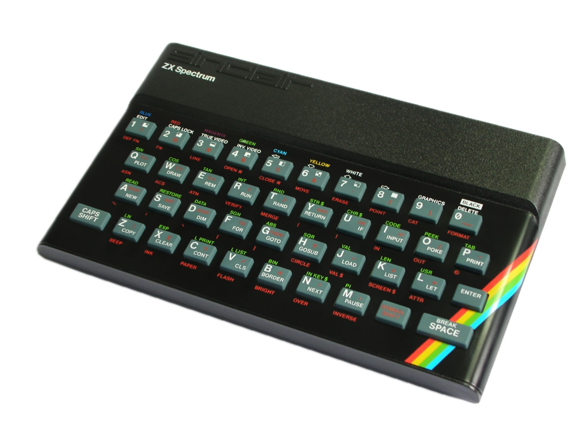

<!--
Pozdravljeni, predstavil vam bom svoje diplomsko delo, pri čemer bom govoril o ...
-->

---

<!-- footer: '' -->

# Povzetek

- ZX Spectrum 48K: zgodovina, zgradba
- cilj dela
- razvoj in končna implementacija
- pregled in ovrednotenje končnih rezultatov

<!--
- računalniku ZX Spectrum, natančneje modelu 48K
- ciljih diplomskega dela
- implementaciji in seveda
- ovrednotenju končnega izdelka
-->

---

<!-- header: '' --->

# ZX Spectrum 48K

<!--
Podjetje Sinclair Research je ZX Spectrum ...
-->

---

<!-- header: '**Zgodovina**' -->

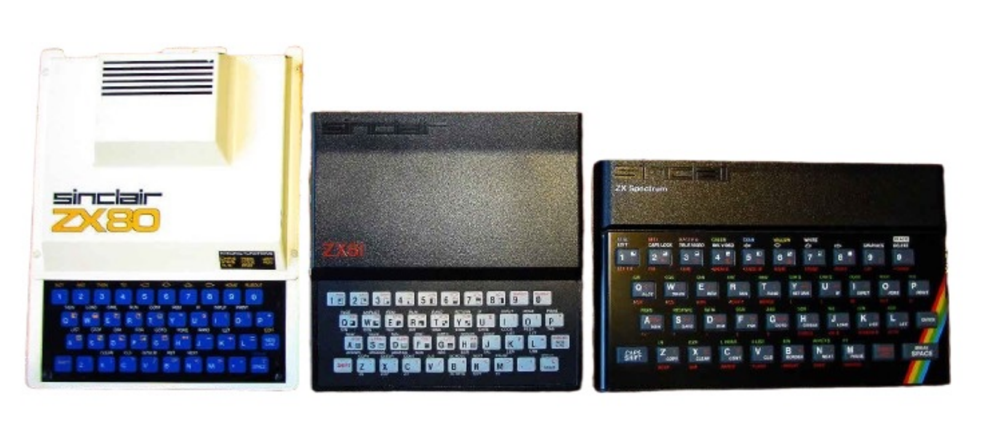

<!--
... predstavilo leta 1982 kot zmogljivejši naslednik nizkocenovnih domačih računalnikov - ZX80, ZX81

Ime Spectrum, poslovenjeno Mavrica, je dobil po novosti, ki jo je prinesel v to linijo računalnikov - barvno grafiko.
-->

---

<!-- header: '**Zgradba**' -->
<!-- _class: columns -->

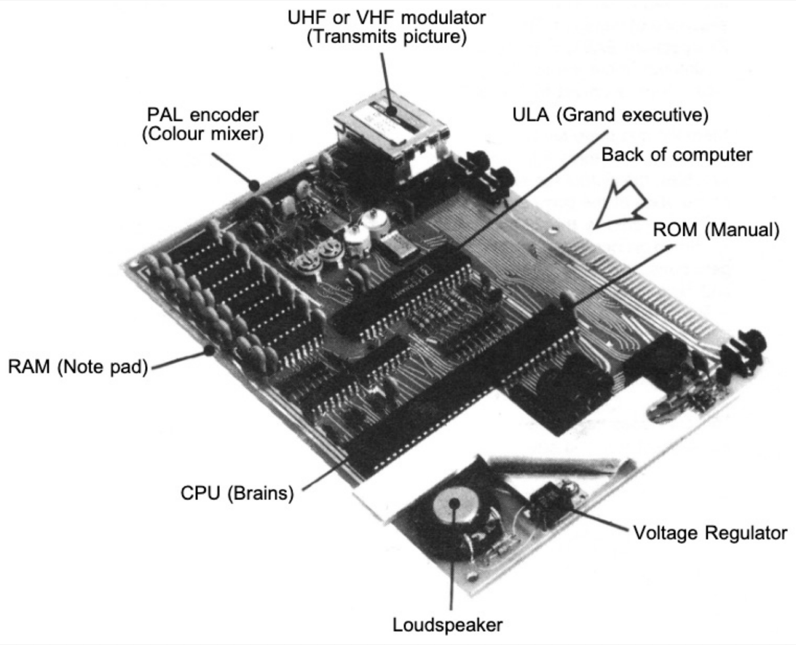
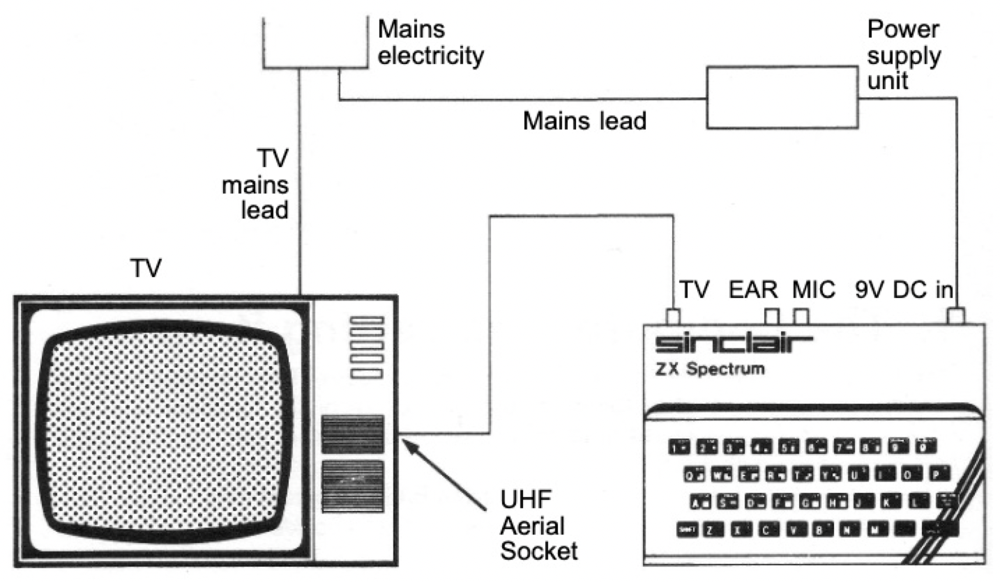

<!--
Računalnik gradijo
- procesor Z80
- bralni pomnilnik oz. ROM
- bralno-pisalni pomnilnik oz. RAM
- ULA, ki predstavlja komunikacijski center sistema za komunikacijo med procesorjem in:
    - tipkovnico
    - zaslonom
    - zvočnikom
    - kasetofonom
-->

---

<!-- header: '' --->

# Cilj dela

<!--
Preden začnem govoriti o ciljih dela, naj razložim še pojem emulacija

Ta predstavlja prevod delovanja sistema gosta (v našem primeru ZX Spectruma) v arhitekturo gostitelja (v našem primeru sodobni računalniki)
-->

---

<!-- header: '**Cilji dela**' -->

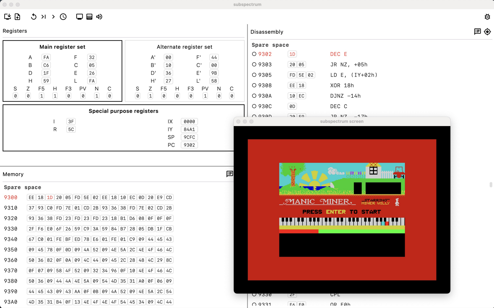

<!--
Cilj dela je razvoj delujočega emulatorja in razhroščevalnika, ki omogoča
- ne le poganjanje programov, temveč tudi
- razhroščevanje z vpogledom v notranje stanje sistema
-->

---

<!-- header: '' --->

# Razvoj

<!--
Emulator sem razvil v ogrodju za razvoj večplatformnih aplikacij - Kotlin Multiplatform.

...
-->

---

<!-- header: 'Arhitektura' -->

Moduli funkcionalnosti:

- `Processor`
- `Memory`
- `ULAScreen`, `ULAKeyboard`, `ULATapeDeck`, `ULABeeper`

<!--
...

Abstraktni model emuliranega sistema pa sem zasnoval tako, da povezuje module funkcionalnosti
- procesorja
- pomnilnika in
- vhodno/izhodnih naprav, ki sem jih omenil prej
-->

---

<!-- header: '' -->

# Pomnilnik

<!--
Začnimo s pomnilnikom Spectruma, ki je razdeljen na 2 dela:
- ROM, ki vsebuje nadzorni program za zagon in razne predpripravljene podprograme, ter
- RAM, ki poleg prostega pomnilnika vsebuje še npr. zaslonsko datoteko, a več o tem kasneje
-->

---

<!-- header: '**Pomnilnik**' -->
<!-- _class: columns -->

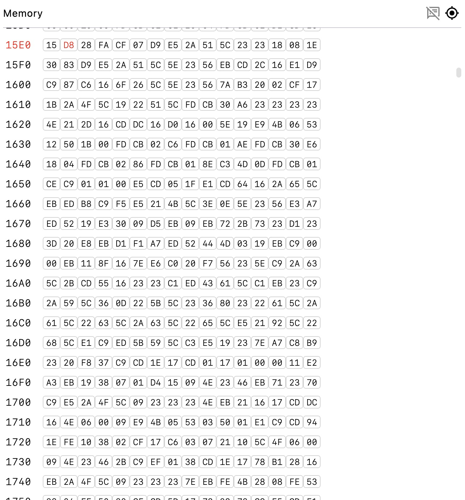
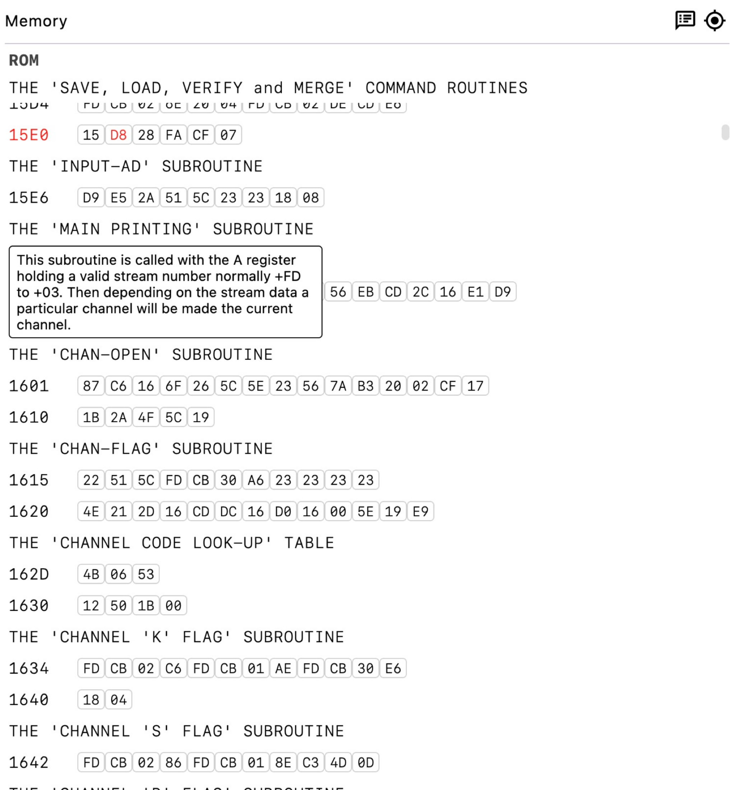

<!--
Implementiran je s 64 kilobajtov velikim poljem zlogov, in funkcijami za branje in pisanje zlogov ali bitov

Podokno razhroščevalnika
- prikazuje vrednosti pomnilniških celic in označi posamezne odseke in njihove namene
- omogoča ročno nastavljanje vrednosti posameznih pomnilniških celic
-->

---

<!-- header: '' -->

# Centralna procesna enota Z80

<!--
Procesor Z80 ...
-->

---

<!-- header: '**Registri in zastavice**' -->

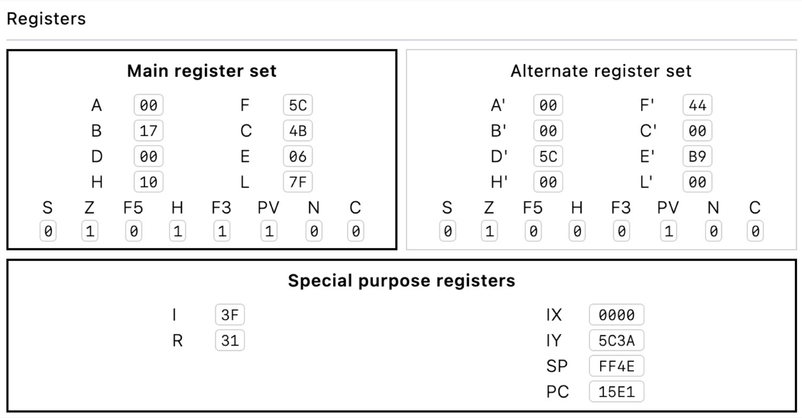

<!--
... vsebuje 18 8-bitnih in 4 16-bitne registre v
- 6 posebnonamenskih registrih in
- dveh registrskih naborih, od katerih vsak vsebuje:
    - akumulator oz. register A za 8-bitne aritmetično-logične operacije
    - register zastavic F značilnosti zadnje izvedene operacije
    - 6 splošnonamenskih registrov, ki jih lahko uporabimo kot posamične 8-bitne registre, ali kot 16-bitne registrske pare

Ta dva registrska nabora, od katerih procesor uporablja le enega naenkrat, omogočata hitro menjavo izvajalnega konteksta, kar je uporabno za npr. hiter odziv na prekinitve
-->

---

<!-- header: '**Ukazi**' -->

CPE Z80:

- 158 ukazov
- 10 tipov naslavljanja
- 3 načini delovanja prekinitev

 

`00rrr110 nnnnnnnn` → `LD r,n`

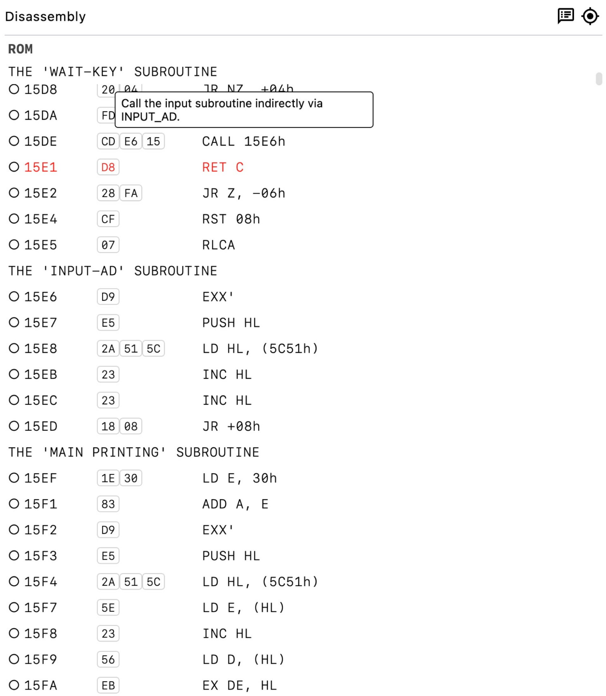

<!--
ZX Spectrum omogoča uporabo programskega jezika BASIC preko tolmača v ROMu, in strojnega jezika neposredno na procesorju.

Pri slednjem procesor Z80 podpira:
- 158 različnih dokumentiranih in mnogo nedokumentiranih ukazov
- 10 tipov naslavljanja
- 3 načine delovanja maskirnih in nemaskirnih prekinitev

Vsaka definicija strojnega ukaza ima določen:
- bitni vzorec, ki definira ukaz in operande, ter
- funkcijo in časovno trajanje izvedbe ukaza
-->

---

<!-- header: '**Izvajanje**' -->

`Processor.step`:

- prebere ukaz
- posodobi programski števec
- ukaz izvede
- poveča števec izvedenih ukazov
- po potrebi proži prekinitve

<!--
Delovanje emuliranega procesorja je organizirano okrog izvedbe posameznega ukaza, kar nam omogoči korakanje skozi izvajajoči-se program

Poleg korakanja skozi program pa emulator podpira tudi tekoči in pospešeni tek programa, ter prekinitvene točke
-->

---

<!-- header: '' -->

# ULA

<!--
ULA kot komunikacijski center sistema preko V/I vrat skrbi za operacije, ki se dotikajo nekaterih V/I naprav

Začnimo z ...
-->

---

<!-- header: '**Zaslon**' -->
<!-- _class: columns -->

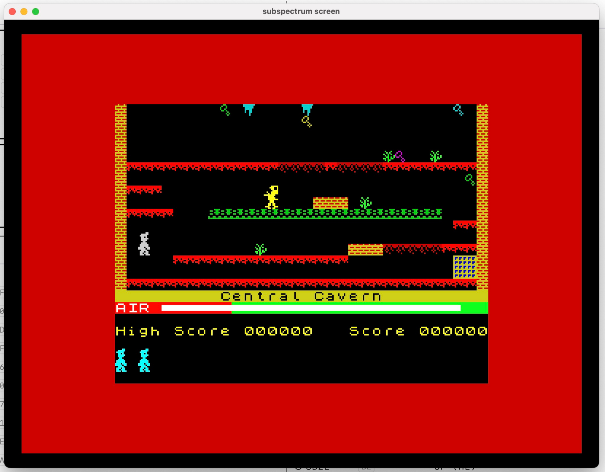
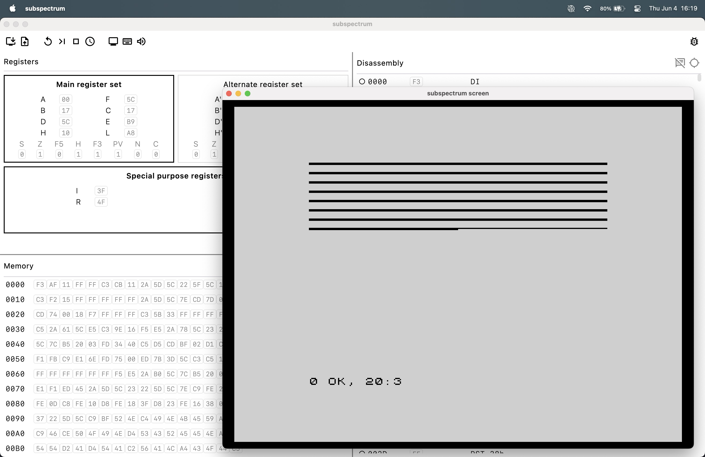

<!--
zaslonom, ki se ob periodičnih prekinitvah izrisuje na podlagi sekcij pomnilnika:
- zaslonska datoteka določa aktivnost pik: papir kot ozadje ali črnilo kot ospredje
- sekcija z atributi pa določa barvo papirja in črnila, svetlost in utripanje pozameznih znakov na zaslonu

Posebnost zaslonske datoteke je nelinearen razpored shranjevanja vrednosti pik
-->

---

<!-- header: '**Tipkovnica**' -->

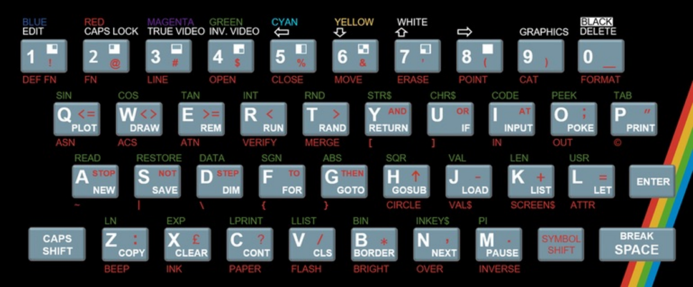

<!--
Tipkovnica je razdeljena na 8 polvrstic po 5 tipk

Branje tipkovnice iz strojnega programa nam da vedeti, katere tipke izbranih polvrstic so pritisnjene
-->

---

<!-- header: '**Kasete**' -->

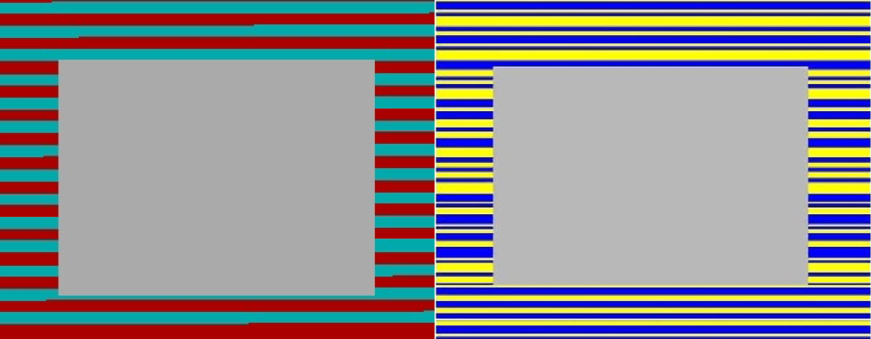

<!--
Navadne zvočne kasete predstavljajo trajno shrambo uporabniških programov

Emulator implementira dekodiranje in nalaganje zapisov kaset, a namesto emuliranja zvočnih impulzov posnema le končni učinek.
To prinese
- hitrejše in zanesljivejše delovanje, a obstaja
- možnost, da programi, ki neposredno merijo dolžine impulzov, niso polno podprti
-->

---

<!-- header: '**Zvok**' -->

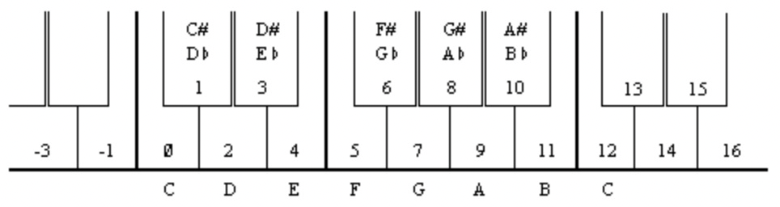

<!--
ZX Spectrum ima vgrajen en zvočnik oz. piskač, ki predstavlja enobitni zvočni izhod (v praksi osnovni C fiksne glasnosti)
-->

---

<!-- header: '' -->

# Evalvacija

<!--
Emulator je nastal v zadnjem letu in obsega več kot 70.000 vrstic kode, pravilnost emulacije pa sem preveril z zagonom treh izbranih programov.
-->

---

<!-- header: '**Pravilnost emulacije** - Manic Miner' -->

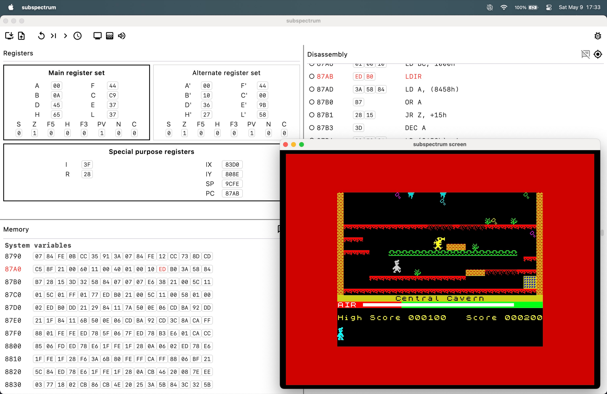

<!--
Preizkušeni so bili:
- popularna arkadna igra Manic Miner
...
-->

---

<!-- header: '**Pravilnost emulacije** - INES' -->

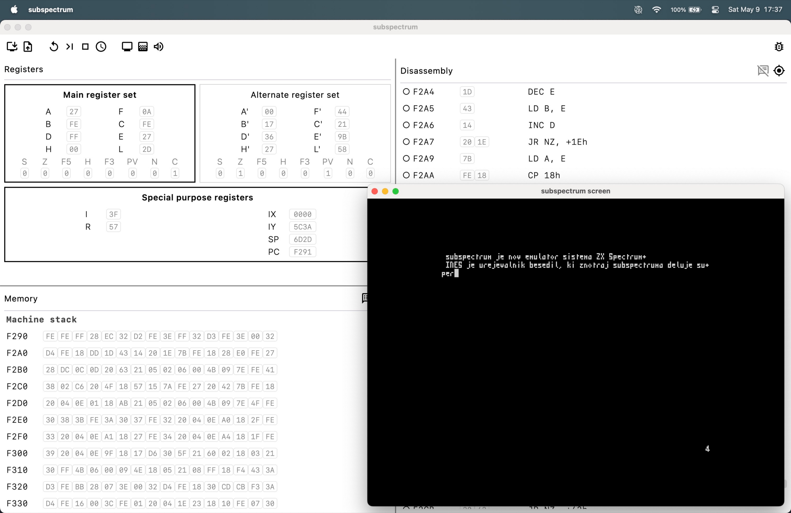

<!--
...
- slovenski urejevalnik besedil INES, ki med drugim podpira uporabo slovenskih črk
...
-->

---

<!-- header: '**Pravilnost emulacije** - Kontrabant' -->

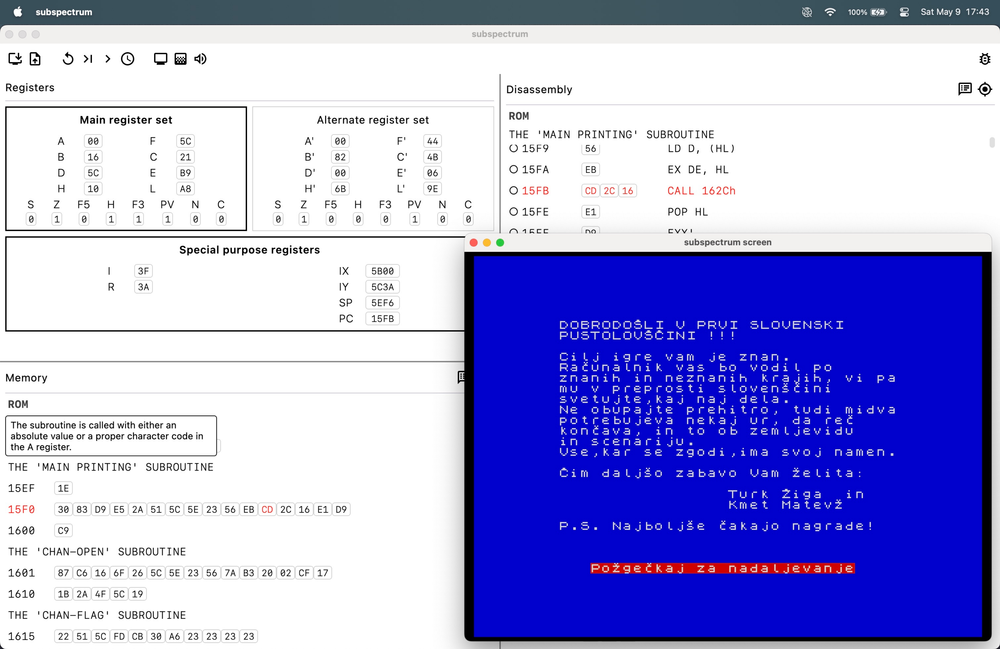

<!--
...
- ter slovenska besedilna pustolovska igra Kontrabant

Vsi ti programi
- se pravilno naložijo iz datotek posnetkov kaset
- delujejo brez opaznih napak z delujočo sliko, zvokom in upravljanjem preko tipkovnice

Razhroščevalnik pri tem pravilno podpira:
- tako prikaz stanja sistema
- kot tudi uporabniške posege vanj
-->

---

<!-- header: '' -->
<!-- _class: columns -->

<!--
Emulator tako ni le način poganjanja stare programske opreme, temveč služi tudi kot učno in predstavitveno orodje za razumevanje in digitalno ohranjanje
delovanja sistema in zanj napisanih programov

Hvala za vašo pozornost!
-->
